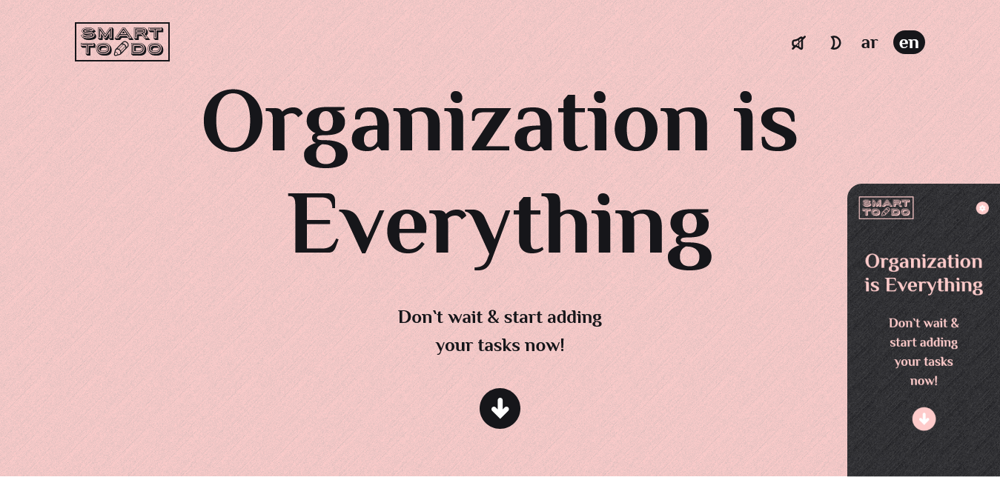

# Smart Todo

This is a fully responsive mobile-friendly todo list app which is awesome and easy to use.

## Table of contents

- [Overview](#overview)
  - [The challenge](#the-challenge)
  - [Screenshot](#screenshot)
  - [Links](#links)
- [My process](#my-process)
  - [Built with](#built-with)
- [Author](#author)

## Overview

### The challenge

Users should be able to:

- View the optimal layout for the site depending on their device's screen size
- Make a use of the app's basic CRUD operations & enjoy a good user experience through it's other features like sound effects, two light modes & the support of two languages.

### Screenshot

### Links

- Live Site URL: [Add live site URL here](https://smart-todo.netlify.app/)

## My process

### Built with

- Semantic HTML5 markup
- CSS custom properties
- Flexbox
- Mobile-first workflow
- Vanilla JavaScript
- HTML Web Storage API (localStorage Object)

## Author

- Website - [Shaher Ashraf](shaherashraf77@gmail.com)
